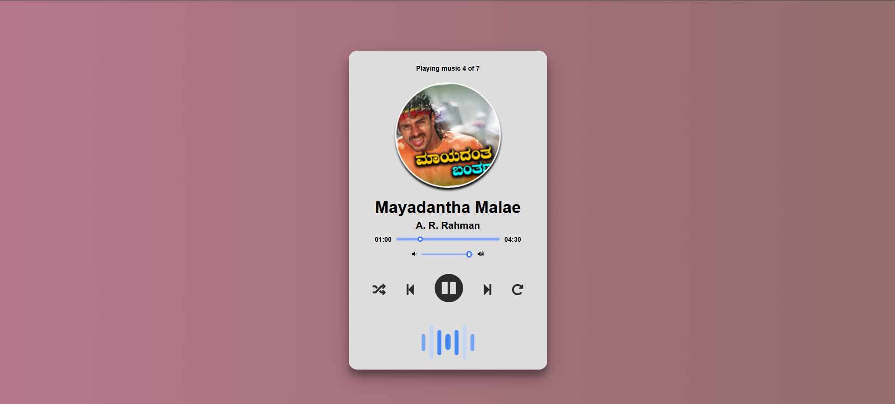

# Music Player

This is a simple and elegant music player web application. It allows you to play, pause, skip tracks, adjust volume, and more. The design is responsive and looks great on all devices.



## Features

- Play and pause tracks
- Skip to the next or previous track
- Adjust volume
- Seek through the track
- Shuffle and repeat tracks
- Display current track details

## Technologies Used

- HTML
- CSS
- JavaScript
- Font Awesome

## How to Use

1. Clone the repository:
    ```bash
    git clone https://github.com/yourusername/music-player.git
    ```
2. Open the `index.html` file in your web browser.

## Screenshot


## License

This project is licensed under the MIT License.